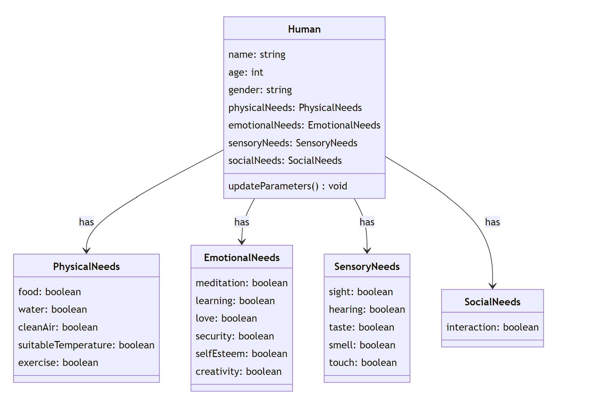

# Human Body Simulator

This project simulates a human body using a Python class. Code is generated using ChatGPT4. It models basic human activities like breathing, eating, drinking, exercising, resting, excreting, and sweating. It also tracks various parameters like oxygen level, nutrient level, waste level, water level, energy level, and muscle mass.

 

 # Human emotions
 
 

# Human needs
 
 

### In slow progress

#Note : Human guided ChatGPT4 outputs.
