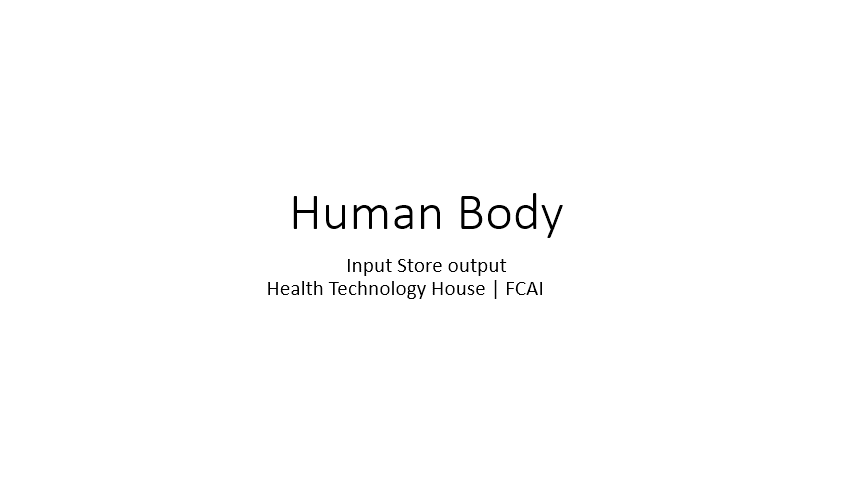
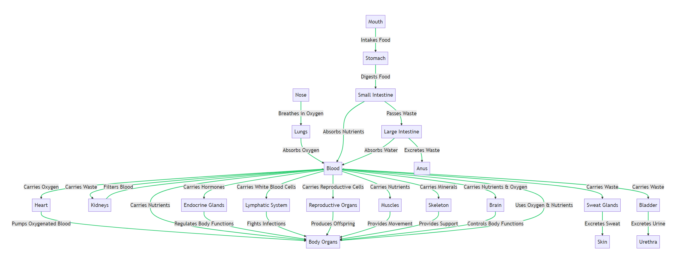
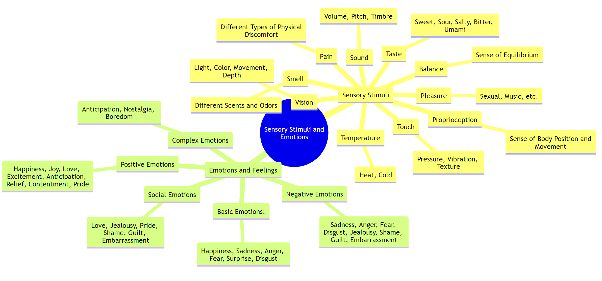
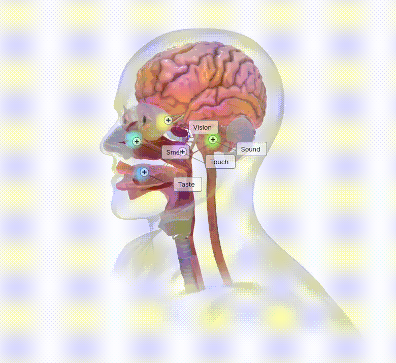
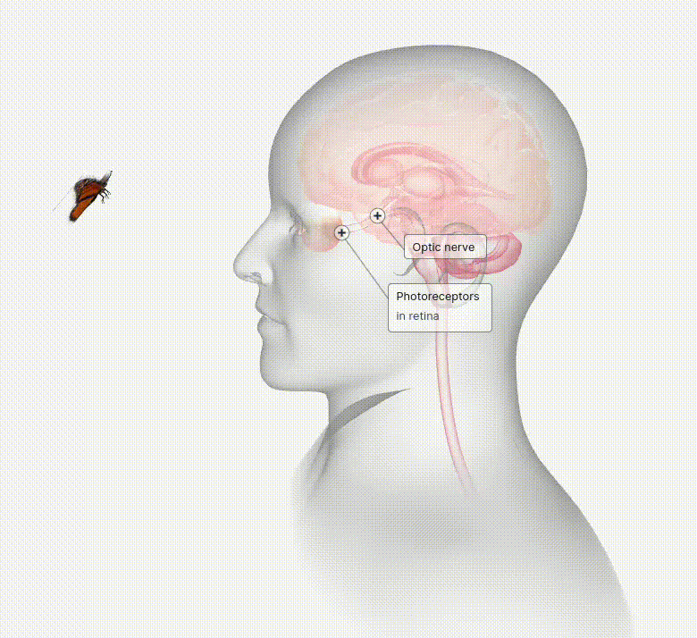
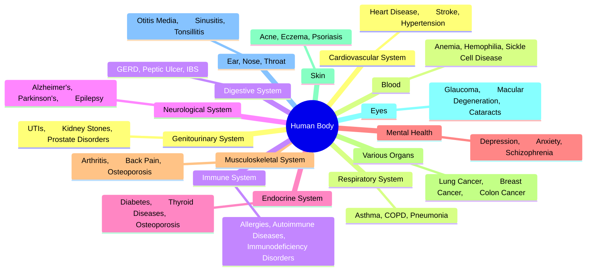

# Human Body Simulator

This project simulates a human body using a Python class. Code is generated using ChatGPT4. It models basic human activities like breathing, eating, drinking, exercising, resting, excreting, and sweating. It also tracks various parameters like oxygen level, nutrient level, waste level, water level, energy level, and muscle mass.


Note: anatomy images are taken from [https://human.biodigital.com/](https://human.biodigital.com/)

 


# Human Sensory and Emotions
 
 
 
<table>
  <tr>
    <td></td>
    <td></td>
    <td></td>
  </tr>
  <tr>
    <td></td>
    <td></td>
    <td></td>
  </tr>
</table>
Taken from Human Biodigital

# Human needs
 
```mermaid
 classDiagram
  class Human {
     name: string
     age: int
     gender: string
     physicalNeeds: PhysicalNeeds
     emotionalNeeds: EmotionalNeeds
     sensoryNeeds: SensoryNeeds
     socialNeeds: SocialNeeds
     updateParameters(): void
  }
  class PhysicalNeeds {
     food: boolean
     water: boolean
     cleanAir: boolean
     suitableTemperature: boolean
     exercise: boolean
  }
  class EmotionalNeeds {
     meditation: boolean
     learning: boolean
     love: boolean
     security: boolean
     selfEsteem: boolean
     creativity: boolean
  }
  class SensoryNeeds {
     sight: boolean
     hearing: boolean
     taste: boolean
     smell: boolean
     touch: boolean
  }
  class SocialNeeds {
     interaction: boolean
  }
  Human --> PhysicalNeeds : has
  Human --> EmotionalNeeds : has
  Human --> SensoryNeeds : has
  Human --> SocialNeeds : has
  ```

# Human disease cure
| Disorder/Disease/Symptom | Natural Cure | Medicinal Cure |
| --- | --- | --- |
| Common Cold | Rest, hydration, warm liquids (like chicken soup), saline nasal sprays | Over-the-counter cold remedies, decongestants, pain relievers |
| Influenza (Flu) | Rest, hydration, warm liquids | Antiviral drugs prescribed by a doctor |
| Hypertension (High Blood Pressure) | Regular exercise, a healthy diet low in sodium, stress management | Antihypertensive medications |
| Diabetes | Healthy diet, regular exercise, maintaining a healthy weight | Insulin therapy, oral or injected medications |
| Heart Disease | Regular exercise, healthy diet, quitting smoking | Medications, surgery, lifestyle changes |
| Asthma | Breathing exercises, maintaining a healthy weight, avoiding triggers | Inhalers, long-term control medications |
| Arthritis | Physical activity, heat and cold therapy, weight loss if overweight | Pain relievers, anti-inflammatory drugs, physical therapy |
| Depression | Exercise, sleep, a healthy diet, mindfulness meditation | Antidepressants, psychotherapy |
| Anxiety Disorders | Stress management techniques, exercise, relaxation techniques | Psychotherapy, medications |
| Allergies | Avoiding allergens, nasal rinse | Antihistamines, nasal steroids, allergy shots |


```mermaid
graph TB
  A["Virus/Bacteria"] -- "Infection" --> B["Common Cold"]
  A -- "Infection" --> C["Influenza"]
  A -- "Infection" --> D["Urinary Tract Infection"]
  A -- "Infection" --> E["Gastroenteritis"]
  A -- "Infection" --> F["Pneumonia"]
  B -- "Symptoms" --> G["Fever, Cough, Sore Throat"]
  C -- "Symptoms" --> H["Fever, Cough, Body Aches"]
  D -- "Symptoms" --> I["Fever, Pain, Frequent Urination"]
  E -- "Symptoms" --> J["Fever, Diarrhea, Vomiting"]
  F -- "Symptoms" --> K["Fever, Cough, Difficulty Breathing"]
  G -- "Cure" --> L["Rest, Hydration, Over-the-counter Cold Remedies"]
  H -- "Cure" --> M["Rest, Hydration, Antiviral Drugs"]
  I -- "Cure" --> N["Antibiotics, Pain Relievers, Increased Fluid Intake"]
  J -- "Cure" --> O["Rest, Rehydration, Antimotility Medications"]
  K -- "Cure" --> P["Antibiotics, Rest, Oxygen Therapy"]
  linkStyle 0 stroke:#2ecd71,stroke-width:2px;
  linkStyle 1 stroke:#2ecd71,stroke-width:2px;
  linkStyle 2 stroke:#2ecd71,stroke-width:2px;
  linkStyle 3 stroke:#2ecd71,stroke-width:2px;
  linkStyle 4 stroke:#2ecd71,stroke-width:2px;
  linkStyle 5 stroke:#2ecd71,stroke-width:2px;
  linkStyle 6 stroke:#2ecd71,stroke-width:2px;
  linkStyle 7 stroke:#2ecd71,stroke-width:2px;
  linkStyle 8 stroke:#2ecd71,stroke-width:2px;
  linkStyle 9 stroke:#2ecd71,stroke-width:2px;
  linkStyle 10 stroke:#2ecd71,stroke-width:2px;
  linkStyle 11 stroke:#2ecd71,stroke-width:2px;
  linkStyle 12 stroke:#2ecd71,stroke-width:2px;
  linkStyle 13 stroke:#2ecd71,stroke-width:2px;
  linkStyle 14 stroke:#2ecd71,stroke-width:2px;
```
## Human body Ailments



## Human Society
Life of a human is governed by interactions within the society. Typically humans live in a society. Rules governing the society affect humans both positively and negatively. Factors affecting physical and mental health may stem from the rules in the society which need to be updated once in a while based on current societal state.


|                             | Legal Rules | Social Norms | Moral and Ethical Rules | Economic Rules | Environmental Rules | Rules of belief | Rules of Reciprocity | Rules of Relationship |
|-----------------------------|-------------|--------------|-------------------------|----------------|---------------------|-----------------|----------------------|-------------------------------|
| Legal Rules                 |     -       | Shapes       | Incorporates            | Formalizes     | Includes Provisions | Reflected In    |                      | Reflected In                  |
| Social Norms                | Influenced By |     -        | Influence               | Shape          | Influenced By       | Influence       | Influence            | Shape                         |
| Moral and Ethical Rules     | Reflected In | Shape        |     -                   | Influenced By  | Influenced By       | Shape           | Influence            |                               |
| Economic Rules              | Formalized In | Influenced By | Influenced By           |     -          | Influenced By       |                 | Influence            | Influence                     |
| Environmental Rules         | Enforced Through | Influenced By | Influenced By         | Influenced By  |     -               |                 |                      |                               |
| Rules of belief             | Reflected In | Influence    | Inform                  |                |                     |     -           |                      | Influence                     |
| Rules of Reciprocity        |             | Influence    | Influence               | Influence      |                     |                 |     -                |                               |
| Rules of Relationship  | Reflected In | Shape        |                         | Influence      |                     | Influence       |                      |     -                         |


Note: Table matrix generated, and links reasoned by ChatGPT4 


### In slow progress

#Note : Human guided ChatGPT4 outputs.
